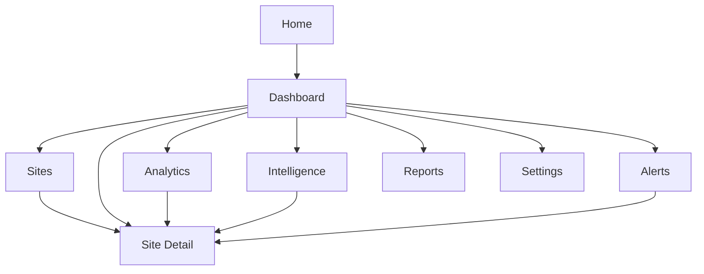

# EMWAC Platform PRD Draft

## 1. Product Summary

EMWAC Platform is a web-based environmental monitoring product focused on real-time water quality observation, site-level analysis, alerting, and decision support.

The first version is designed as a platform product rather than a single dashboard page. It should support:

- real-time site monitoring
- map-based monitoring views
- historical trend analysis
- algorithm-driven risk and anomaly insights
- alert and reporting workflows

This draft assumes that data ingestion already exists or will be added later. The current scope focuses on the user-facing platform, mock data structure, and algorithm-ready product design.

## 2. Product Vision

Build a platform that allows users to:

- understand current environmental conditions at a glance
- compare water quality across monitoring sites
- identify anomalies and risk conditions early
- review historical patterns and emerging trends
- present findings clearly to researchers, partners, and operators

## 3. Scope Assumptions

These assumptions define the v0.1 planning baseline:

- The product is a web platform.
- Device onboarding and data ingestion management are out of scope for the first phase.
- Data is assumed to already be available in a normalized format.
- The platform initially monitors water-related environmental metrics.
- Initial metrics include `Temp`, `pH`, `DO`, `EC`, and `Nitrate`.
- Site count is assumed to be between 3 and 20 in the early phase.
- Data refresh frequency is assumed to be every 1 to 5 minutes.
- The first release should be deployable and demo-ready.
- The first release should reserve clear extension points for real data integration and algorithms.

## 4. Product Goals

### Primary Goals

- Provide a single platform view for environmental monitoring.
- Make real-time conditions easy to understand.
- Support site exploration through map, charts, and detail pages.
- Create a foundation for algorithm integration and future automation.

### Non-Goals For Phase 1

- sensor provisioning
- device firmware management
- ingestion rule configuration UI
- advanced administration workflows
- full MLOps or model training infrastructure

## 5. Target Users

### 5.1 Research User

Needs:

- inspect site trends
- compare multiple indicators
- view historical context
- review algorithm outputs

### 5.2 Operations User

Needs:

- detect abnormal sites quickly
- identify offline or risky stations
- monitor latest readings
- review alerts

### 5.3 Project Stakeholder

Needs:

- understand system status at a glance
- see site distribution and summary trends
- access reports and platform-level KPIs

## 6. Core User Stories

- As a user, I want to open the dashboard and immediately see overall platform health.
- As a user, I want to click a site on the map and view the latest readings and risk status.
- As a user, I want to open a site detail page and inspect historical trends for each metric.
- As a user, I want to compare multiple sites over a selected time range.
- As a user, I want to see which sites are currently abnormal and why.
- As a user, I want to review algorithm outputs such as anomaly detection and risk scores.
- As a user, I want to export data summaries for reporting or external review.

## 7. Product Modules

### 7.1 Public Home

Purpose:

- introduce the platform
- show monitoring coverage
- summarize current conditions

Core content:

- platform hero section
- mission and project summary
- site count and status summary
- latest readings snapshot
- map preview
- recent alerts preview

### 7.2 Dashboard

Purpose:

- provide the operational command center

Core content:

- KPI cards
- real-time map
- latest readings feed
- alert summary
- trend preview
- system health status

### 7.3 Sites

Purpose:

- provide site discovery and comparison

Core content:

- site list
- filter by status
- search by site name
- map/list toggle
- quick status preview

### 7.4 Site Detail

Purpose:

- provide a single station deep dive

Core content:

- latest metrics
- trend charts
- threshold bands
- alert history
- algorithm results
- site metadata
- data quality status

### 7.5 Analytics

Purpose:

- support deeper historical analysis and cross-site comparison

Core content:

- multi-site comparison
- multi-metric charts
- date range filtering
- aggregation mode switching
- downloadable results

### 7.6 Intelligence

Purpose:

- surface algorithm-driven insights

Core content:

- anomaly events
- risk scores
- trend forecasts
- confidence and explanation panels
- site ranking by risk

### 7.7 Alerts

Purpose:

- centralize attention-worthy events

Core content:

- active alerts
- alert severity
- alert type filters
- acknowledgement status
- linked site context

### 7.8 Reports

Purpose:

- support export and summary workflows

Core content:

- report templates
- period-based summaries
- site summaries
- export actions

### 7.9 Settings

Purpose:

- provide minimal platform configuration in phase 1

Core content:

- project metadata
- threshold presets
- display preferences

## 8. Information Architecture

### 8.1 Route Map

- `/`
- `/dashboard`
- `/sites`
- `/sites/[siteId]`
- `/analytics`
- `/intelligence`
- `/alerts`
- `/reports`
- `/settings`

### 8.2 Navigation Model

- Top-level navigation should expose Dashboard, Sites, Analytics, Intelligence, Alerts, Reports, and Settings.
- Home may be public or semi-public depending on deployment needs.
- Site detail pages are reachable from the map, site list, alerts, and analytics views.

### 8.3 Page Relationship Diagram



## 9. Page Requirements

### 9.1 Home

Must have:

- hero section
- project description
- summary statistics
- map overview
- latest update timestamp
- CTA to enter dashboard

### 9.2 Dashboard

Must have:

- total site count
- online site count
- abnormal site count
- last update time
- real-time map
- latest reading table or cards
- active alert preview
- short-term trends

### 9.3 Sites

Must have:

- searchable site list
- status filters
- site cards or table
- quick metrics preview
- map-linked interactions

### 9.4 Site Detail

Must have:

- site metadata
- latest reading cards
- 24h and 7d charts
- recent alerts
- algorithm insights
- data quality indicators

### 9.5 Analytics

Must have:

- compare multiple sites
- compare multiple metrics
- select time range
- switch aggregation level
- export chart data

### 9.6 Intelligence

Must have:

- site risk ranking
- anomaly timeline
- per-site algorithm summary
- explanation panel
- forecast preview if available

### 9.7 Alerts

Must have:

- active and historical alerts
- severity filters
- site links
- timestamps
- rule or reason summary

### 9.8 Reports

Must have:

- report list
- date range selection
- export options
- summary content blocks

## 10. Data Model Draft

### 10.1 Entities

#### Site

```json
{
  "id": "site-001",
  "name": "Black Covert",
  "code": "BC01",
  "latitude": 52.3340,
  "longitude": -3.9531,
  "status": "warning",
  "region": "Aberystwyth",
  "description": "Primary monitoring station near river section A",
  "lastSeenAt": "2026-03-28T12:00:00Z"
}
```

#### Reading

```json
{
  "id": "reading-20260328-1200-site-001",
  "siteId": "site-001",
  "timestamp": "2026-03-28T12:00:00Z",
  "metrics": {
    "temp": 14.2,
    "ph": 7.3,
    "do": 8.4,
    "ec": 251.1,
    "nitrate": 2.3
  },
  "qualityFlag": "good",
  "source": "mock"
}
```

#### Alert

```json
{
  "id": "alert-001",
  "siteId": "site-001",
  "type": "threshold",
  "severity": "medium",
  "title": "Nitrate above expected range",
  "message": "Nitrate has exceeded the configured threshold for 20 minutes.",
  "status": "active",
  "triggeredAt": "2026-03-28T11:40:00Z"
}
```

#### Algorithm Result

```json
{
  "id": "algo-001",
  "siteId": "site-001",
  "timestamp": "2026-03-28T12:00:00Z",
  "riskScore": 72,
  "riskLevel": "high",
  "anomalyDetected": true,
  "anomalyType": "multi-metric deviation",
  "explanation": "EC and nitrate are elevated while dissolved oxygen is declining relative to the 7-day baseline.",
  "confidence": 0.82
}
```

## 11. Metric Definitions

Initial metric set:

- `Temp` in degrees C
- `pH`
- `DO` in mg/L
- `EC` in uS/cm or equivalent chosen unit
- `Nitrate` in mg/L

Each metric should support:

- current value
- trend direction
- normal range
- threshold status
- historical chart series

## 12. Algorithm Strategy

### 12.1 Phase 1 Algorithm Types

- threshold breach detection
- rate-of-change anomaly detection
- missing data detection
- simple composite risk scoring

### 12.2 Phase 2 Algorithm Types

- short-term trend prediction
- site comparison anomaly detection
- quality classification
- event correlation across metrics

### 12.3 Product Rules For Algorithm Outputs

- Every algorithm result must be explainable in plain language.
- Users should see both a label and a reason.
- Risk should be represented as score plus level.
- Confidence should be shown when appropriate.
- Algorithm views should link back to site detail and raw trends.

## 13. Alerting Model

Initial alert types:

- threshold breach
- offline site
- stale data
- anomaly detection event
- data quality warning

Each alert should include:

- site
- severity
- reason
- start time
- current status
- optional resolution time

## 14. Design Principles

- Clear first-glance status recognition
- Map-first exploration for site monitoring
- Charts should support both overview and detail
- Algorithm output should be understandable, not just technical
- The platform should feel operational, not academic-only
- The layout should scale from demo mode to production mode

## 15. Non-Functional Requirements

- responsive design for desktop and tablet
- performant dashboard load under typical data volume
- support for future real-time subscription updates
- clear empty states and loading states
- easy replacement of mock data with real APIs
- modular architecture for future user roles and backend growth

## 16. MVP Scope

### In Scope

- Home
- Dashboard
- Sites
- Site Detail
- Analytics
- Intelligence
- Alerts
- mock data source
- basic alert logic
- basic algorithm result presentation
- deployable frontend demo

### Out Of Scope

- device management UI
- ingestion pipeline configuration
- user role management depth
- advanced report scheduling
- model training workflows

## 17. Suggested MVP Build Order

### Phase A

- finalize PRD
- define design direction
- define mock schema
- scaffold frontend app

### Phase B

- build dashboard
- build sites page
- build site detail page
- build analytics page

### Phase C

- build intelligence page
- build alerts page
- add report view
- polish responsive behavior

### Phase D

- prepare deployment
- review copy and labels
- replace mock adapters with real data adapters later

## 18. Open Questions

The following decisions should be confirmed next:

- Should Home be public or login-only?
- Is the platform mainly for research, operations, or both?
- Which three metrics matter most in the first demo?
- How many sample sites should appear in the MVP?
- Should the first release be English-only or bilingual?
- Is report export a phase 1 requirement or phase 2 feature?
- Should intelligence be a top navigation item from day one?

## 19. Recommended Next Deliverables

After this PRD is approved, the next artifacts should be:

- low-fidelity wireframes for all main pages
- mock data file set and seed scenarios
- UI design direction and component inventory
- frontend project scaffold

## 20. MVP Priority Table

### P0 Must Have

- dashboard overview
- site list and site detail pages
- real-time style latest reading widgets using mock data
- map-based site exploration
- trend charts for key metrics
- active alerts view
- algorithm result cards with explainable output
- responsive deployable frontend

### P1 Should Have

- analytics comparison page
- report summary page
- richer filtering and date range controls
- alert acknowledgement states
- multiple chart presets such as 24h, 7d, and 30d

### P2 Could Have

- bilingual support
- custom saved views
- downloadable PDF reports
- advanced algorithm tuning controls
- stakeholder presentation mode
